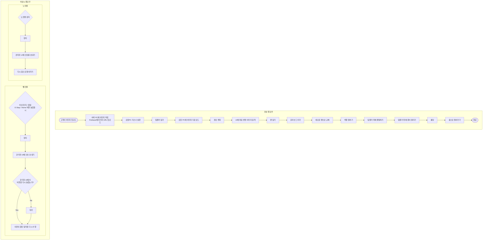
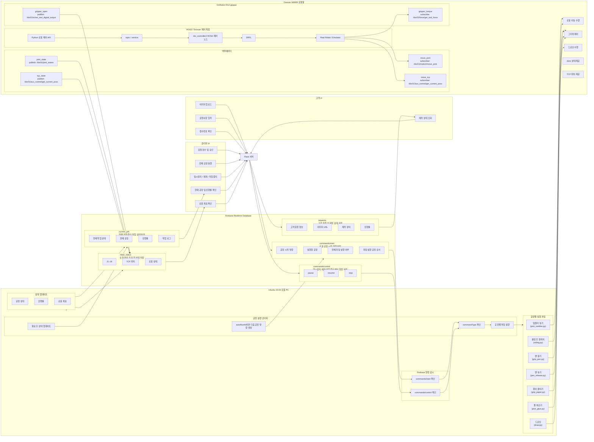

# 🎨 텀블러 드로잉 & 부착 로봇 시스템

Doosan M0609 협동로봇을 활용해 이미지를 종이에 그린 뒤,
그 종이를 텀블러에 풀칠하여 부착하는 전체 자동화 공정 시스템입니다.
Flask 웹서버 + Firebase + ROS2로 고객 요청부터 로봇 실행까지 전체 파이프라인을 구성했습니다.

## 👤 담당 역할

이 프로젝트는 6인 팀 프로젝트이며, 그중 드로잉(이미지 → 로봇 그리기) 파트는
저를 포함한 2명이 함께 작업했습니다. 제가 주로 담당한 부분은 다음과 같습니다.

- **이미지 전처리** — 엣지 검출, 더블 엣지 아티팩트 보정 (adaptive thresholding + morphological closing)
- **색칠(Fill) 로직** — 윤곽선 내부 영역 채색 처리
- **역기구학(IK) 및 좌표 변환** — 픽셀 좌표 → 로봇 좌표 변환, 캔버스 센터링/축 반전/회전 로직

같은 드로잉 파트의 Bézier 곡선 피팅, 경로 최적화는 함께 작업한 팀원이 담당했고,
그리퍼 픽업·풀칠·부착 동작, Flask/Firebase 서버, 관리자 UI 등은 나머지 팀원들이 담당했습니다.

---

## 📋 목차

1. [통합 플로우 차트](#-통합-플로우-차트)
2. [시스템 아키텍처](#-시스템-아키텍처)
3. [운영체제 환경](#-운영체제-환경)
4. [사용한 장비 목록](#-사용한-장비-목록)
5. [의존성](#-의존성-requirementstxt)
6. [실행 방법](#-실행-방법)

---

## 🔄 통합 플로우 차트



---

## 🏗️ 시스템 아키텍처



---

## ⚙️ 운영체제 환경

### 서버 PC
- OS: Ubuntu 22.04
- Python: 3.10.12
- Flask: 웹 서버 실행

### 로봇 PC
- OS: Ubuntu 22.04
- ROS2: Humble
- Python: 3.10.12
- 로봇: Doosan M0609

### 공통
- Firebase Realtime Database (asia-southeast1)
- opencv-contrib-python

---

## 🤖 사용한 장비 목록

### 로봇
- Doosan M0609 협동로봇
- 그리퍼: GripperDA_v1

### 컴퓨터
- 서버 PC: Flask 웹 서버 실행용
- 로봇 PC: ROS2 + 로봇 제어용

### 네트워크
- Firebase Realtime Database (Google Cloud, asia-southeast1)

### 기타
- 펜 (black, red)
- 텀블러
- 종이
- 롤러
- 레고
- 목공풀

---

## 📦 의존성 (requirements.txt)

### 서버 PC

firebase-admin

flask

werkzeug

### 로봇 PC

firebase-admin

opencv-contrib-python

numpy

rclpy              # ROS2 (pip 아닌 ROS2 설치로 사용)

cv-bridge          # ROS2 (pip 아닌 ROS2 설치로 사용)

### 공통 설치 명령
```bash
pip install firebase-admin flask werkzeug opencv-contrib-python numpy
```

---

## 🚀 실행 방법

### 1. 서버 PC

```bash
# Firebase 키 경로 설정 확인
# config.py → FIREBASE_SERVICE_ACCOUNT_KEY

# Flask 서버 실행
cd ~/cobot_ws/src/d3project
python3 ./run_server.sh
```

### 2. 로봇 PC

```bash
# ROS2 환경 설정
source /opt/ros/humble/setup.bash
source ~/cobot_ws/install/setup.bash

# 로봇 드라이버 실행 (별도 터미널)
ros2 launch dsr_launcher2 dsr_bringup2.launch.py \
    model:=m0609 mode:=real host:=192.168.137.100

# 로봇 상태 Firebase 업로드 (별도 터미널)
python3 write_to_firebasev2.py

# 리스너 실행 (별도 터미널)
cd ~/cobot_ws/src/d3project
python3 robot_command_listener_pause_resume_auto.py
```

### 3. 실행 순서 요약

1. 서버 PC - Flask 서버 실행
2. 로봇 PC - ROS2 드라이버 실행
3. 로봇 PC - write_to_firebasev2.py 실행
4. 로봇 PC - robot_command_listener 실행
5. 브라우저 - http://서버PC_IP:5000 접속
6. 브라우저 - http://서버PC_IP:5000/admin/dashboard 관리자 접속
